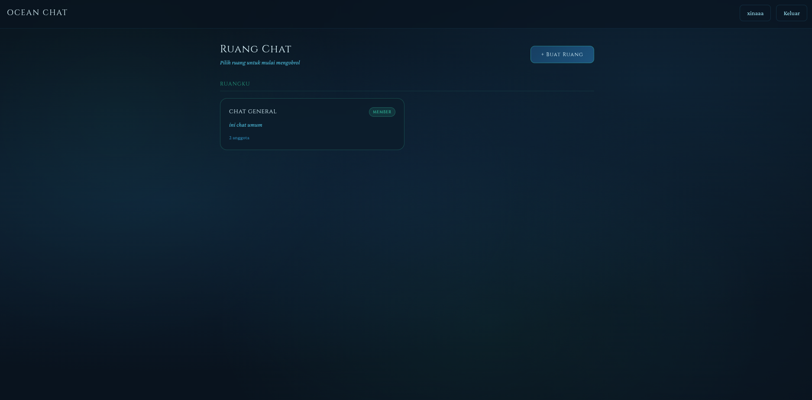
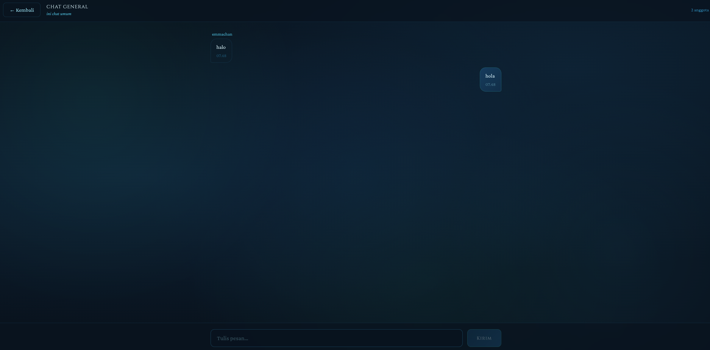
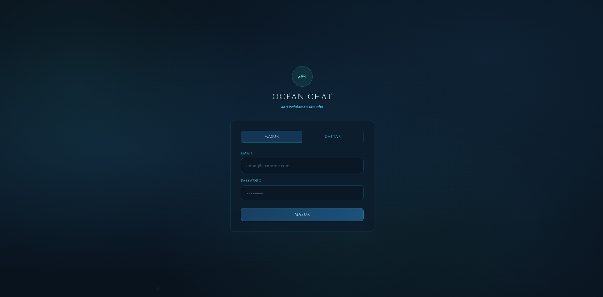

# 🌊 Chat Ocean

A real-time chat application built with **Next.js (Frontend)** and **Go (Backend)**, powered by Firebase Authentication.

https://chatoceanfrontend-production.up.railway.app <-- deploy chat ocean
---

## ✨ Features

* 🔐 Authentication (Firebase)
* 💬 Real-time chat rooms
* 👤 User profile management
* ⚡ Fast REST API with Go
* 🌐 Modern UI with Next.js + Tailwind

---

## 🏗️ Tech Stack

### Frontend

* Next.js
* TypeScript
* Tailwind CSS
* Firebase Auth

### Backend

* Go (Golang)
* Firebase Admin SDK
* REST API

---

## 📸 Preview

### 🏠 Home Page



### 💬 Chat Room



### 👤 Login and Register Page



> ⚠️ Note: Tambahkan screenshot ke folder `docs/images/`

---

## 📂 Project Structure

```
chat_ocean/
│
├── backend/
│   ├── handlers/
│   ├── middleware/
│   ├── firebase/
│   └── main.go
│
├── frontend/
│   ├── app/
│   ├── context/
│   ├── lib/
│   └── public/
│
└── README.md
```

---

## ⚙️ Installation

### 1. Clone Repo

```bash
git clone https://github.com/username/chat_ocean.git
cd chat_ocean
```

---

### 2. Setup Backend (Go)

```bash
cd backend
go mod tidy
cp .env.example .env
go run main.go
```

---

### 3. Setup Frontend (Next.js)

```bash
cd frontend
npm install
npm run dev
```

---

## 🔑 Environment Variables

### Backend `.env`

```
FIREBASE_API_KEY=your_key
FIREBASE_PROJECT_ID=your_project
```

---

### Frontend `.env.local`

```
NEXT_PUBLIC_FIREBASE_API_KEY=your_key
```

---

## 🚨 Security Notes

* Jangan commit:

  * `.env`
  * `serviceAccountKey.json`
* Gunakan `.env.example` sebagai template

---

## 🛠️ API Endpoints (Example)

| Method | Endpoint | Description   |
| ------ | -------- | ------------- |
| GET    | /rooms   | Get all rooms |
| POST   | /rooms   | Create room   |
| GET    | /users   | Get users     |

---

## 📌 Future Improvements

* 🔔 Real-time WebSocket
* 📱 Mobile responsive UI
* 🧠 Message AI features
* 📁 File sharing
